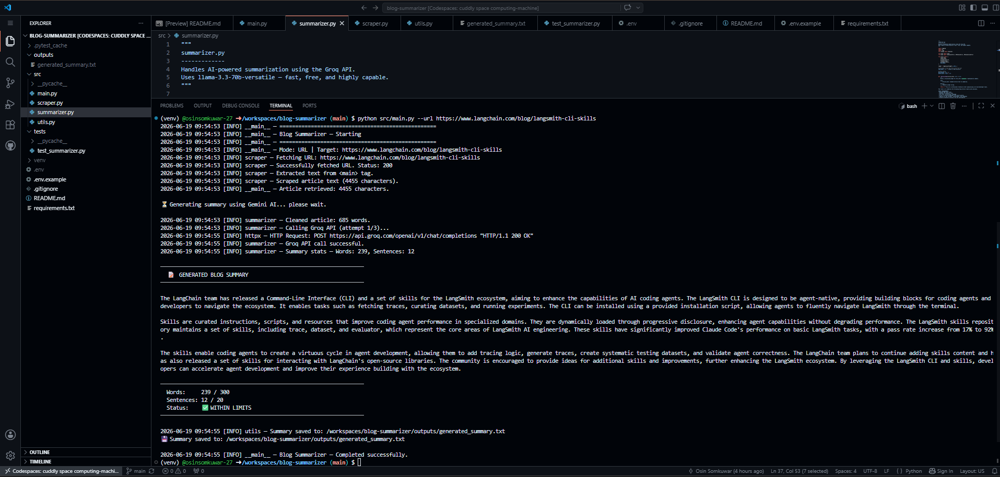

#  Blog Summarizer — AI-Powered Article Summarization

[](https://python.org)
[](https://ai.google.dev)
[](LICENSE)
[](https://peps.python.org/pep-0008/)

An intelligent, production-grade Python CLI tool that scrapes any blog URL (or reads a local text file) and uses **Google Gemini AI** to generate a concise, professional summary in **≤300 words and ≤20 sentences**.

---

##  Project Overview

This tool solves a common developer pain point: blogs and technical articles are getting longer, but your reading time isn't. The Blog Summarizer automates the entire pipeline — from URL to polished summary — in seconds, using state-of-the-art generative AI to preserve context and technical accuracy.

---

##  Features

-  **URL scraping** — Fetch and extract article content from any public blog
-  **File input** — Alternatively, summarize from a local `.txt` file
-  **Gemini AI** — Uses `gemini-1.5-flash` for fast, accurate summarization
-  **Hard constraints** — Summary is always ≤300 words and ≤20 sentences
-  **Retry logic** — Exponential backoff on API rate limits and transient errors
-  **Edge case handling** — Empty input, invalid URLs, short articles, long articles, missing API key
-  **Output saving** — Summary auto-saved to `outputs/generated_summary.txt`
-  **Verbose logging** — Full debug mode available with `--verbose`
-  **Unit tested** — Pytest test suite covering all core functionality

---

##  Project Structure

```
blog-summarizer/
│
├── src/
│   ├── main.py          # CLI entry point and orchestration
│   ├── summarizer.py    # Gemini API integration and summarization logic
│   ├── scraper.py       # Web scraping (requests + BeautifulSoup)
│   └── utils.py         # Preprocessing, validation, file I/O, logging
│
├── outputs/
│   └── generated_summary.txt   # Auto-generated output file
│
├── tests/
│   └── test_summarizer.py      # Pytest unit tests
│
├── .env.example         # Template for environment variables
├── .gitignore
├── requirements.txt
└── README.md
```

---

##  Architecture

```
┌─────────────────────────────────────────────────────────────┐
│                        main.py (CLI)                        │
│          Parses args → Orchestrates pipeline → Displays     │
└────────────────────────┬────────────────────────────────────┘
                         │
           ┌─────────────▼─────────────┐
           │        Input Layer        │
           │   URL Mode  │  File Mode  │
           └──────┬──────┴──────┬──────┘
                  │             │
     ┌────────────▼──┐    ┌─────▼────────────┐
     │  scraper.py   │    │    utils.py       │
     │               │    │  read_text_file() │
     │ 1. Validate   │    └─────┬─────────────┘
     │    URL        │          │
     │ 2. Fetch HTML │          │
     │ 3. Parse with │          │
     │    BS4        │          │
     └────────┬──────┘          │
              │                 │
              └────────┬────────┘
                       │  raw article text
              ┌────────▼────────┐
              │    utils.py     │
              │                 │
              │ 1. clean_text() │
              │ 2. truncate()   │
              │ 3. short check  │
              └────────┬────────┘
                       │  preprocessed text
              ┌────────▼────────┐
              │  summarizer.py  │
              │                 │
              │ 1. Build prompt │
              │ 2. Call Gemini  │
              │ 3. Retry logic  │
              │ 4. Validate     │
              │ 5. Enforce limit│
              └────────┬────────┘
                       │  final summary
              ┌────────▼────────┐
              │    Output       │
              │                 │
              │ • Terminal      │
              │ • outputs/*.txt │
              └─────────────────┘
```

---

##  Installation

### Prerequisites

- Python 3.11 or higher
- A [Google Gemini API key](https://aistudio.google.com/app/apikey) (free tier available)

### 1. Clone the Repository

```bash
git clone https://github.com/yourusername/blog-summarizer.git
cd blog-summarizer
```

### 2. Create a Virtual Environment

```bash
python -m venv venv

# Activate on macOS/Linux
source venv/bin/activate

# Activate on Windows
venv\Scripts\activate
```

### 3. Install Dependencies

```bash
pip install -r requirements.txt
```

### 4. Set Up Environment Variables

```bash
# Copy the example file
cp .env.example .env

# Edit .env and add your Gemini API key
nano .env   # or use any text editor
```

Your `.env` file should look like:
```
GEMINI_API_KEY=AIzaSy...your_key_here
```

---

##  How To Run

### Summarize a Blog from URL

```bash
python src/main.py --url https://www.langchain.com/blog/langsmith-cli-skills
```

### Summarize from a Local Text File

```bash
python src/main.py --file article.txt
```

### Custom Output Filename

```bash
python src/main.py --url https://example.com/blog --output my_summary.txt
```

### Verbose / Debug Mode

```bash
python src/main.py --url https://example.com/blog --verbose
```

### Run Tests

```bash
pytest tests/test_summarizer.py -v
```

### Run Tests with Coverage

```bash
pytest tests/test_summarizer.py -v --cov=src --cov-report=term-missing
```

---

##  Example Output



---

##  Edge Cases Handled

| Scenario | Handling |
|---|---|
| Invalid URL (missing schema, malformed) | Regex validation before any HTTP call; clear error message |
| Unreachable URL / DNS failure | `requests.ConnectionError` caught; descriptive error shown |
| HTTP 4xx / 5xx responses | `response.raise_for_status()` caught; logged and surfaced |
| Request timeout | Configurable 15s timeout; `Timeout` exception caught |
| Empty article content | Detected post-scrape; exits with informative message |
| Article shorter than summary | Detected by word count threshold; returned as-is |
| Article > 12,000 characters | Truncated at word boundary before API call |
| Missing `GEMINI_API_KEY` | Detected before API call; clear setup instructions shown |
| Gemini API rate limit | Exponential backoff retry (up to 3 attempts) |
| Gemini returns empty response | Detected and treated as failure; error message shown |
| Summary exceeds 300 words | Post-generation enforcement trims at last sentence boundary |
| File not found / permission error | `OSError` caught; user-friendly error message |
| Non-UTF-8 file encoding | `UnicodeDecodeError` caught; error message shown |

---

##  Future Improvements

1. **Hierarchical summarization** — Chunk + map-reduce for articles > 10,000 words
2. **Multi-URL batch mode** — Summarize multiple blogs in one run
3. **Output formats** — Export as Markdown, PDF, or HTML
4. **Summary caching** — Cache by URL hash to avoid re-summarizing identical content
5. **Web UI** — Flask/FastAPI frontend for browser-based access
6. **Language support** — Summarize in multiple target languages via Gemini
7. **Keyword extraction** — Auto-generate tags alongside the summary
8. **Confidence scoring** — Rate how complete and accurate the summary is